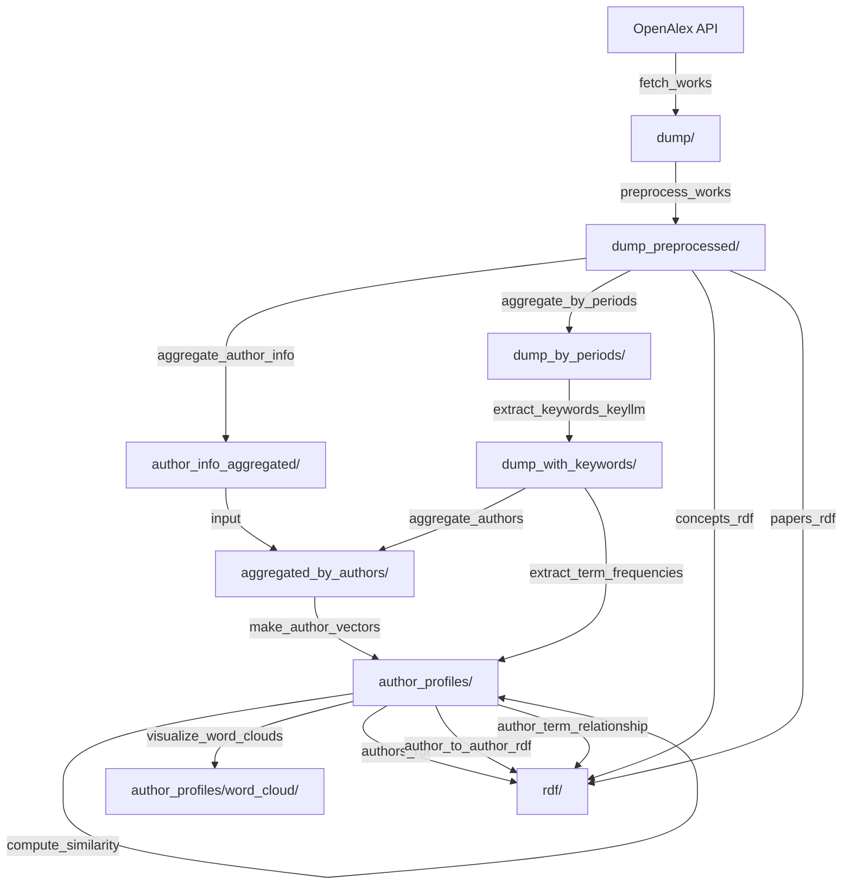

# Concept-CoAuthors (COCOA) visualisation

## Table of content

- [Before starting](#before-starting)
- [Running the Pipeline](#running-the-pipeline)
    + [1. Dataset Collection](#1-dataset-collection)
    + [2. Author Research Output Vector DB](#2-author-research-output-vector-db)
    + [3. Knowledge Graph Construction](#3-knowledge-graph-construction)
        * [3.1 Generate word cloud visualizations](#31-generate-word-cloud-visualizations)
        * [3.2 RDF Generation](#32-rdf-generation)
- [Keyword Extraction](#keyword-extraction)
    + [Methods](#methods)
    + [Evaluation](#evaluation)
        * [Data preparation](#data-preparation)
        * [Algorithm 1a](#algorithm-1a)
        * [Algorithm 1b](#algorithm-1b)
        * [Algorithm 2](#algorithm-2)
        * [Top results](#top-results)

## Before starting

### Clone / Checkout

```bash
git lfs install
```

### Configuration

Create a file `.env` in the root directory of the project and add any of the following environment variables:

```
OPENALEX_API_KEY=
OPENALEX_CONFIG_EMAIL=

HTTP_PROXY=
HTTPS_PROXY=
CURL_CA_BUNDLE=
REQUEST_CA_BUNDLE=
REQUESTS_CA_BUNDLE=
```

## Running the Pipeline



### 1. Dataset Collection

#### 1.1 Fetch the data from OpenAlex

```shell
python -m concepts_visualisation.fetch_works --base-concept C555008776 --output resources/openalex/data/dump
```

- output in `resources/openalex/data/dump`

#### 1.2 Preprocess works

- Filter out works that have been published before 1990
- Cleanup concepts (it requires fetching concepts from the OpenAlex API, or from a cache, which is already stored in `openalex/data/cache_concepts`):
  - removes concept "Battery (electricity)"
  - removes concepts with a score = 0.0

```shell
python -m concepts_visualisation.preprocess_works --input-corpus resources/openalex/data/dump --output resources/openalex/data/dump_preprocessed
```

- input in `resources/openalex/data/dump`
- output in `resources/openalex/data/dump_preprocessed`

#### 1.3 Get author aggregated information

Initially, we planned to aggregate by author, and sort the aggregation by number of publications, however this will duplicate a lot of data and will make impossible to manage.
Instead, we extract author information aggregated all over the papers.
The author information are then sorted by publication and the top 10000 are returned.
The format of each author is as follows: `author_id###name_surname: number of publications`

We can supply an additional file to keep in the selection Openalex IDs from a list.

```shell
python -m concepts_visualisation.aggregate_author_info --input-corpus resources/openalex/data/dump_preprocessed --output resources/openalex/data/author_info_aggregated/authors_aggregated_top10000_by_publications.json --author-list resources/openalex/data/author_info_aggregated/to_be_added.txt
```

- input: `resources/openalex/data/dump_preprocessed`
- author-list: `resources/openalex/data/author_info_aggregated/to_be_added.txt` (diff between curated list of prominent researchers in batteries and list of authors from the script)
- output: `resources/openalex/data/author_info_aggregated/authors_aggregated_top10000_by_publications.json`

#### 1.4 Aggregate publications by period

This task aims to output three files with publications, for each of the three periods.
This should be performed before aggregating by authors as it will make the keyword extraction much simpler and efficient.
Currently aggregating by author will duplicate the works, keyword extraction will not be efficient.

The batch size will determine the number of works for each of the output files.

```shell
python -m concepts_visualisation.aggregate_by_periods --input-corpus resources/openalex/data/dump_preprocessed --output resources/openalex/data/dump_by_periods --batch-size 1000
```

- input: `resources/openalex/data/dump_preprocessed`
- output: `resources/openalex/data/dump_by_periods`

The output will be one file for each period + one file for publication dates outside this period

#### 1.5 Extract keywords with KeyLLM + KeyBERT

There are two options to run the keyword extraction, by corpus directory:

```shell
python -m concepts_visualisation.keyword.extract_keywords_keyllm --input-corpus resources/openalex/data/dump_preprocessed --output-dir resources/openalex/data/dump_with_keywords
```

or by single input/output file:

```shell
python -m concepts_visualisation.keyword.extract_keywords_keyllm --input-json a_json_file.json --output-json output_json_file.json
```

In any case the requests are batched to process them in parallel, however if the batch size is too large, the process might fail due to the context window limitation in chatgpt.

### 2. Author Research Output Vector DB

#### 2.1 Aggregate data by authors

Each record (author) should have:
1. publications grouped by period 1990-1999, 2000-2009, 2010-2023
2. total publication number
3. total publications by first authors

Example output format:

```json
{
  "author1": {
    "nb_publications": 111,
    "1990-2000": {
      "nb_publications": 12,
      "nb_publications_corresp_author": 111,
      "nb_publications_first_author": 1,
      "non_first_author": {
        "concepts": {
          "concept1": {
            "freq": 123,
            "avg_confidence_score": 0.8
          }
        },
        "keywords": {
          "keyword1": {
            "freq": 123,
            "avg_confidence_score": 0.8
          }
        },
        "co_authors": {
          "co_author_id1": 1,
          "co_author_id2": 33
        }
      },
      "first_author": {
        "concepts": {
          "concept1": {
            "freq": 123,
            "avg_confidence_score": 0.8
          }
        },
        "keywords": {
          "keyword1": {
            "freq": 123,
            "avg_confidence_score": 0.8
          }
        },
        "co_authors": {
          "co_author_id1": 1,
          "co_author_id2": 33
        }
      }
    },
    "2001-2010": {
      ...
    }
  }
}
```

```shell
python -m concepts_visualisation.aggregate_authors --input-corpus resources/openalex/data/dump_with_keyllm --input-authors resources/openalex/data/author_info_aggregated/authors_aggregated_top10000_by_publications.json --output resources/openalex/data/aggregated_by_authors
```

- input-corpus: `resources/openalex/data/dump_with_keyllm/`
- input-authors: `resources/openalex/data/author_info_aggregated/authors_aggregated_top10000_by_publications.json`
- output: `resources/openalex/data/aggregated_by_authors`

#### 2.2 Extract concept/keyword frequencies from works

```shell
python -m concepts_visualisation.extract_term_frequencies \
  --input-corpus resources/openalex/data/dump_with_keyllm \
  --output-dir resources/openalex/data/author_profiles
```

- input: `resources/openalex/data/dump_with_keyllm`
- output: `resources/openalex/data/author_profiles` (produces `merged_terms.json` among other files)

#### 2.3 Build author vectors

```shell
python -m concepts_visualisation.make_author_vectors \
  --input-terms resources/openalex/data/author_profiles/merged_terms.json \
  --input-authors resources/openalex/data/aggregated_by_authors/authors.json \
  --output-json resources/openalex/data/author_profiles/author_vectors.json
```

- input-terms: `resources/openalex/data/author_profiles/merged_terms.json`
- input-authors: `resources/openalex/data/aggregated_by_authors/authors.json`
- output: `resources/openalex/data/author_profiles/author_vectors.json`

#### 2.4 Compute author similarity

```shell
python -m concepts_visualisation.compute_similarity \
  --input-author-vectors resources/openalex/data/author_profiles/author_vectors.json \
  --output-json resources/openalex/data/author_profiles/complete_authors.json
```

- input: `resources/openalex/data/author_profiles/author_vectors.json`
- output: `resources/openalex/data/author_profiles/complete_authors.json`

### 3. Knowledge Graph Construction

#### 3.1 Generate word cloud visualizations

```shell
python -m concepts_visualisation.visualize_word_clouds \
  --input-author-vectors resources/openalex/data/author_profiles/author_vectors.json \
  --output-dir resources/openalex/data/author_profiles/word_cloud
```

- input: `resources/openalex/data/author_profiles/author_vectors.json`
- output: `resources/openalex/data/author_profiles/word_cloud/`

#### 3.2 RDF Generation

The following scripts convert pipeline outputs into RDF/Turtle files for knowledge graph construction. All outputs go to `resources/rdf/`.

##### 3.2.1 Authors RDF

Generates RDF triples for authors including name, ORCID, publication counts, and affiliation. Affiliation is derived from the most frequent institution across an author's works in the dump.

```shell
python -m concepts_visualisation.rdf.authors_rdf \
  --input-json resources/openalex/data/author_profiles/complete_authors.json \
  --input-corpus resources/openalex/data/dump_preprocessed \
  --output resources/rdf/authors_graph.ttl
```

- input-json: `resources/openalex/data/author_profiles/complete_authors.json`
- input-corpus (optional): `resources/openalex/data/dump_preprocessed` (used for affiliation data)
- output: `resources/rdf/authors_graph.ttl`

##### 3.2.2 Author-to-Author Similarity RDF

Generates RDF triples representing the top-N most similar authors for each author, along with their matching concept/term.

```shell
python -m concepts_visualisation.rdf.author_to_author_rdf \
  --input-json resources/openalex/data/author_profiles/complete_authors.json \
  --output resources/rdf/author_to_author_graph.ttl
```

- input: `resources/openalex/data/author_profiles/complete_authors.json`
- output: `resources/rdf/author_to_author_graph.ttl`
- `--top-n` (default: 5): number of similar authors per author

##### 3.2.3 Author-Term Relationship RDF

Generates RDF triples linking each author to their top 20 terms (concepts/keywords), sorted by score.

```shell
python -m concepts_visualisation.rdf.author_term_relationship \
  --input-json resources/openalex/data/author_profiles/complete_authors.json \
  --output resources/rdf/author_term_graph.ttl
```

- input: `resources/openalex/data/author_profiles/complete_authors.json`
- output: `resources/rdf/author_term_graph.ttl`

##### 3.2.4 Concepts RDF

Generates RDF triples for all unique concepts found across works in the dump, including OpenAlex and Wikidata identifiers.

```shell
python -m concepts_visualisation.rdf.concepts_rdf \
  --input-corpus resources/openalex/data/dump_preprocessed \
  --output resources/rdf/concepts_graph.ttl
```

- input: `resources/openalex/data/dump_preprocessed`
- output: `resources/rdf/concepts_graph.ttl`

##### 3.2.5 Papers RDF

Generates RDF triples for all unique papers found in the dump, including title, DOI, publication year/date, and (when available) open access status and publisher.

```shell
python -m concepts_visualisation.rdf.papers_rdf \
  --input-corpus resources/openalex/data/dump_preprocessed \
  --output resources/rdf/papers_graph.ttl
```

- input: `resources/openalex/data/dump_preprocessed`
- output: `resources/rdf/papers_graph.ttl`

## Keyword Extraction

### Methods

The project supports multiple extraction approaches:
- **Basic KeyBERT**: `keyword/extract_keywords.py`
- **LLM-powered**: `keyword/extract_keywords_llm.py`
- **KeyLLM integration**: `keyword/extract_keywords_keyllm.py`
- **Tree-based extraction**: `keyword/extract_keywords_tree.py`

### Evaluation

#### Data preparation

Compute an evaluation between different extraction methods with the keywords extracted from the PDF document. We use https://github.com/kermitt2/article_dataset_builder to download and process documents with grobid. We provide article_dataset_builder with the list of deduplicated DOIS: [dois_openalex.sorted.uniqe.txt](resources%2Fdata%2Fopenalex%2Fdata_contamination%2Fdois_openalex.sorted.uniqe.txt)

We collect the data from the structure created by article_dataset_builder:

```bash
find data -type f -name "*.xml" -exec grep -q '<keywords>' {} \; -exec dirname {} \; | sort -u | xargs -I {} cp -r {} /Users/lfoppiano/development/projects/concepts-visualisation/resources/data/openalex/sample_with_keywords/
```

We extracted the list of `<keywords><term></term><....` from the tei.xml files from Grobid.

> command to be added

We process the abstracts using the three methods:

```bash
for file in resources/openalex/data/sample_with_keywords/*/*.abstract.openalex.txt; do echo ${file}; python -m concepts_visualisation.keyword.extract_keywords --input $file --output "${file%.abstract.openalex.txt}.keybert.json" ; done
```

```bash
for file in resources/openalex/data/sample_with_keywords/*/*.abstract.openalex.txt; do echo ${file}; python -m concepts_visualisation.keyword.extract_keywords --input $file --output "${file%.abstract.openalex.txt}.batteryonlybert.json" --transformer ../embeddings/pre-trained-embeddings/batteryonlybert-cased/ ; done
```

```bash
for file in resources/openalex/data/sample_with_keywords/*/*.abstract.openalex.txt; do echo ${file}; python -m concepts_visualisation.keyword.extract_keywords_llm --input $file --output "${file%.abstract.openalex.txt}.chatgpt.json"; done
```

The structure of the sample is as follow:

- corpus
    + file1
        + file1.abstract.txt: Abstract
        + file1.batteryonlybert.json: keywords extracted by batteryonlybert-cased
        + file1.keybert.json: keywords extracted by keybert
        + file1.chatgpt.json: keywords extracted by chatgpt
        + file1.keywords.txt: the expected keywords
        + file1......
    + file2
        + ....

We finally process the metrics:

```shell
python -m concepts_visualisation.keyword.evaluate_keywords --input-corpus resources/openalex/data/sample_with_keywords
```

#### Algorithm 1a

1. Read the 3 files + the expected file
2. Remove the confidence scores when needed and trim each list to the minimum length between the three extracting methods (e.g. if keybert extracted only 5 and the other extracted 10 keywords, we limit all to the 5 most important keywords)
3. For each document,
    - for each method:
        - sort the keywords
        - search for the most similar one in the expected list (based on sentence BERT)
        - sum the similarity score - continue, ignoring the matching expected keyword
    - calculate average for in the same method
    - sum each average similarity by method
4. average by the number of documents (100)

Results @5 keywords:

| method                 | avg. similarity |
|------------------------|-----------------|
| keybert                | 0.3806          |
| chatgpt                | 0.3798          |
| batteryscibert_cased   | 0.2978          |
| batteryonlybert        | 0.2904          |
| batteryscibert_uncased | 0.2382          |

Results @10 keywords:

N/A The algorithm was fixed because we realised that the sorting was penalising possible matches.

#### Algorithm 1b

**TLDR**: Same as Algorithm 1a but without the sorting at the beginning

1. Read the 3 files + the expected file
2. Remove the confidence scores when needed and trim each list to the minimum length between the three extracting methods (e.g. if keybert extracted only 5 and the other extracted 10 keywords, we limit all to the 5 most important keywords)
3. For each document,
    - for each method:
        - search for the most similar one in the expected list (based on sentence BERT)
        - sum the similarity score - continue, ignoring the matching expected keyword
    - calculate average for in the same method
    - sum each average similarity by method
4. average by the number of documents (100)

Results @5 keywords:

| method                 | avg. similarity |
|------------------------|-----------------|
| chatgpt                | 0.3915          |
| keybert                | 0.3799          |
| batteryscibert_cased   | 0.2955          |
| batteryonlybert        | 0.2817          |
| batteryscibert_uncased | 0.2388          |

Results @10 keywords:

| method                 | avg. similarity |
|------------------------|-----------------|
| chatgpt                | 0.2182          |
| keybert                | 0.2102          |
| batteryscibert_cased   | 0.1674          |
| batteryonlybert        | 0.1616          |
| batteryscibert_uncased | 0.1375          |

#### Algorithm 2

Goal: evaluating while expanding the keywords

1. Read the 3 files + the expected file
2. Remove the confidence scores when needed and trim each list to the minimum length between the three extracting methods (e.g. if keybert extracted only 5 and the other extracted 10 keywords, we limit all to the 5 most important keywords)
3. For each document:
    - for each expected keyword:
        - get similarity with each predicted keyword
        - filter similarities > 0.5
        - sum the cosine similarity
    - calculate average for in the same method
    - sum each average similarity by method
4. average by the number of documents (100)

Results @5 keywords:

| method                 | avg. similarity |
|------------------------|-----------------|
| chatgpt                | 0.6827          |
| keybert                | 0.6340          |
| batteryscibert_cased   | 0.5625          |
| batteryonlybert        | 0.5063          |
| batteryscibert_uncased | 0.4133          |

Results @10 keywords:

| method                 | avg. similarity |
|------------------------|-----------------|
| chatgpt                | 0.6983          |
| keybert                | 0.6431          |
| batteryscibert_cased   | 0.6204          |
| batteryonlybert        | 0.6063          |
| batteryscibert_uncased | 0.5609          |

#### Top results

We re-evaluated using abstracts from OpenAlex, and algorithm 2 over extraction of 10 keywords.

| method                 | avg. similarity |
|------------------------|-----------------|
| chatgpt                | 0.6781          |
| batteryscibert_cased   | 0.6698          |
| batteryonlybert        | 0.6677          |
| keybert                | 0.6665          |
| batteryscibert_uncased | 0.5423          |
